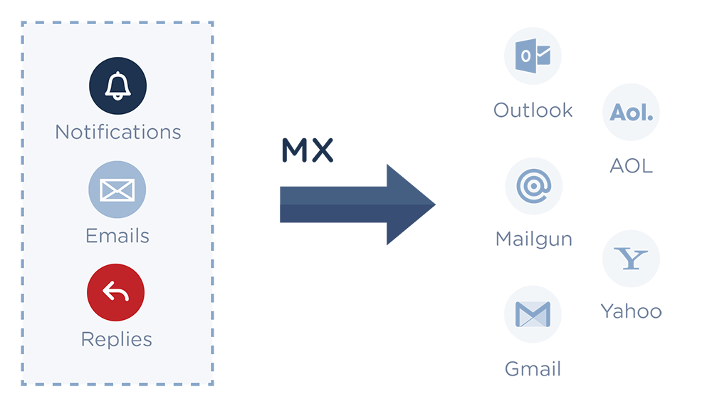

.. _quickstart-receiving:

How to start receiving inbound email
====================================

Add Receiving MX Records
---------------------------

Your domain needs Mailgun MX records to handle inbound messages. Open up your DNS provider and add these.  `MX Information`_

========= =========================================================== ==================== 
Type      Value														  Purpose
========= =========================================================== ==================== 
MX        mxa.mailgun.org 											  Receiving (Optional)
MX        mxb.mailgun.org											  Receiving (Optional)
========= =========================================================== ==================== 

.. warning:: Do not configure Receiving MX DNS records if you already have another provider handling inbound 
		     mail delivery for your domain (e.g. Gmail). Instead we recommend using a subdomain on Mailgun (e.g. mg.yourdomain.com)
		     
.. _MX Information: http://en.wikipedia.org/wiki/MX_record

Inbound Routes and Parsing
---------------------------

You can define a list of **routes to handle incoming emails** and prioritize the sequence
of their execution.

* Each **route consists of a filter expression and an action**.
* When a message is received, Mailgun evaluates the filter expression against it.
* If the expression is true, the action is executed.

Regular expressions can be used to match against message recipients or
arbitrary headers such as subject. 

Examples of filter expressions for routes
^^^^^^^^^^^^^^^^^^^^^^^^^^^^^^^^^^^^^^^^^

================================ ===========================================================
Expression                       Description
================================ ===========================================================
match_recipient("bob@myapp.com") Returns true if the incoming message is going to bob@myapp.com.
match_recipient(".*@myapp.com")  Returns true if the incoming message is going to any user
                                 at @myapp.com.
match_header("subject", "hello") Returns true if the subject of the message contains word 'hello'.
catch_all()                      Returns true if no other route matched, to implement catch-all
                                 behaviour.
================================ ===========================================================

Supported actions for routes
^^^^^^^^^^^^^^^^^^^^^^^^^^^^

================================= ===========================================================
Action                            Description
================================= ===========================================================
forward("http://myapp/post")      Parses the message and forwards it to a given URL.
forward("support@myapp.com")      Forwards the message to a given email address.
store(notify="http://myapp/post") Stores the message temporarily to be retrieved later.
stop()                            Stops and doesn't look at any other routes.
================================= ===========================================================

Routes can be defined and tested using the Mailgun API (in addition, to using the
Control Panel).

.. include:: samples/create-route.rst

The example above defines a new route which will forward all messages coming to
@samples.mailgun.org to http://myhost.com/messages and will stop evaluating any other routes.

Now let's look at how to build HTTP handlers for incoming messages, i.e. what needs
to be done on your end to handle a message that Mailgun forwards to your URL.

Consider this Django code:

.. code-block:: python

    # Handler for HTTP POST to http://myhost.com/messages for the route defined above
    def on_incoming_message(request):
         if request.method == 'POST':
             sender    = request.POST.get('sender')
             recipient = request.POST.get('recipient')
             subject   = request.POST.get('subject', '')

             body_plain = request.POST.get('body-plain', '')
             body_without_quotes = request.POST.get('stripped-text', '')
             # note: other MIME headers are also posted here...

             # attachments:
             for key in request.FILES:
                 file = request.FILES[key]
                 # do something with the file

         # Returned text is ignored but HTTP status code matters:
         # Mailgun wants to see 2xx, otherwise it will make another attempt in 5 minutes
         return HttpResponse('OK')

Mailgun routes are very powerful. For example, you can use regular expression captures and refer
to captured values in your destination.

To learn more about Routes, check out the :ref:`um-routes` section of the :ref:`user-manual`.
