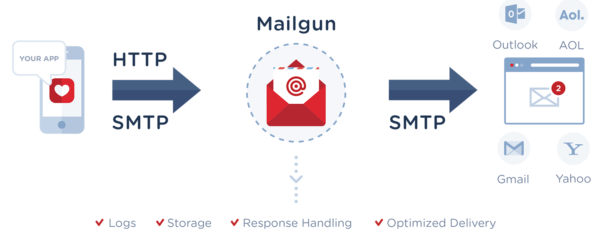
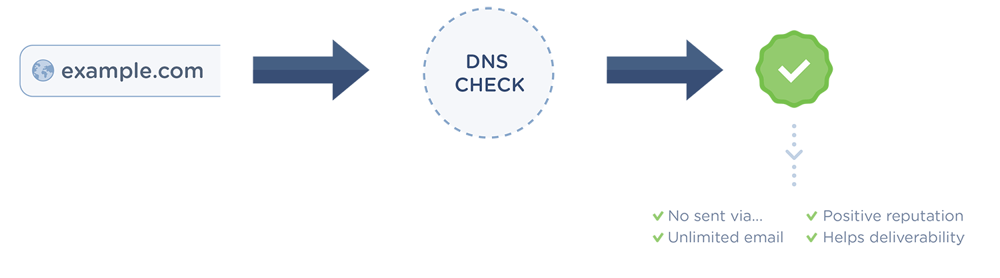

.. _quickstart-sending:

How to start sending email
==========================

Send with SMTP or API
---------------------

It’s up to you, whatever you find easier is fine with us. Here's something to consider:

.. raw:: html

  <table class="docutils tbl-smtpapi">
  <thead>
    <tr>
      <th class="head">SMTP</th>
      <th class="head">API</th>
    </tr>
  </thead>
  <tbody>
    <tr>
      <td><i class="icon-ok"></i> Flexible with existing apps</td>
      <td><i class="icon-ok"></i> Faster (x3)</td>
    </tr>
    <tr>
      <td><i class="icon-ok"></i> Open protocol</td>
      <td><i class="icon-ok"></i> Assembly (don't worry about MIME)</td>
    </tr>
    <tr>
      <td></td>
      <td><i class="icon-ok"></i> Scales better (Batch sending)</td>
    </tr>
  </tbody>
  </table>

In short, SMTP is an open and established protocol with large ecosystem, while Mailgun API is better long term performance and maintenance wise.

Send via API
^^^^^^^^^^^^^

Run this:

.. include:: samples/send-simple-message.rst

What actually happened:

* Mailgun assembled a MIME message.
* Added the log entries to our full text search index.
* Delivered the email.

You can find your secret API key on your `dashboard`_.

.. _dashboard: https://app.mailgun.com/app/dashboard

Send via SMTP
^^^^^^^^^^^^^

Run this:

.. include:: samples/smtp-send-simple-message.rst

You can find your SMTP credentials for each domain on your `domains tab`_.

.. _domains tab: https://app.mailgun.com/app/domains

Verify Your Domain
------------------

Add a domain you own and verify it by setting up the DNS records we provide (known as SPF and DKIM) at your DNS provider.

Why you **need to verify** your domain:

* To prove that you are an **authorized sender** for the domain.
* Verified domains are not subject to a **sending limit of 300** emails per day.
* No more **"sent via Mailgun.org"** message in your emails.
* Establishing a **positive email reputation** for your own domain. 
* Mailgun is **less suspicious** of traffic that is being sent on verified domains and so using one reduces the likelihood of being disabled. 

How to verify your domain
^^^^^^^^^^^^^^^^^^^^^^^^^

1. Add your domain or subdomain.
2. Open your DNS provider and add the **two TXT DNS records** provided.
3. If you want Mailgun to **track clicks and opens** you can also add the **CNAME** record.
4. MX records should also be added, **unless you already have MX records** for your domain pointed at another email service provider (e.g. Gmail).

Once you've added the records and they've propagated, your domain will be verified.

.. note:: It can take 24-48 hours for DNS changes to propagate.

If you will be creating a lot of domains, Mailgun offers an API endpoint for adding/editing/removing domains from your account. See the :ref:`api-domains` endpoint for more information.

Add Sending & Tracking DNS Records
^^^^^^^^^^^^^^^^^^^^^^^^^^^^^^^^^^

* **SPF**: Sending server IP validation. Used by majority of inbound mail servers. `SPF Information`_.
* **DKIM**: Like SPF, but uses cryptographic methods for validation. Supported by many inbound mail servers. `DKIM Information`_ 
* **CNAME**: Used for tracking opens and clicks, when enabled. :ref:`tracking-messages`

========= =========================================================== ==================== 
Type      Value                                                       Purpose    
========= =========================================================== ==================== 
TXT       "v=spf1 include:mailgun.org ~all"                           SPF (Required)
TXT       *Find this record in your Control Panel, Domains Tab*       DKIM (Required)
CNAME     "mailgun.org"                                               Tracking (Optional)
========= =========================================================== ==================== 

.. note:: While the CNAME is listed as optional, it is required to enable Unsubscribe and Click tracking links. 

.. _SPF Information: http://www.openspf.org/Introduction
.. _DKIM Information: http://www.dkim.org/#introduction

Add Receiving MX Records
^^^^^^^^^^^^^^^^^^^^^^^^

Mail server for handling inbound messages.  `MX Information`_

========= =========================================================== ==================== 
Type      Value														  Purpose
========= =========================================================== ==================== 
MX        mxa.mailgun.org 											  Receiving (Optional)
MX        mxb.mailgun.org											  Receiving (Optional)
========= =========================================================== ==================== 

.. _MX Information: http://en.wikipedia.org/wiki/MX_record

.. warning:: Do not configure Receiving MX DNS records if you already have another provider handling inbound 
		     mail delivery (e.g. Gmail).

Common DNS Providers
---------------------

Common providers are listed below. If yours is not listed, contact your DNS provider for assistance.

GoDaddy: `MX <http://support.godaddy.com/help/article/7924/adding-or-editing-mx-records?locale=en>`__ - `CNAME <http://support.godaddy.com/help/article/7921/adding-or-editing-cname-records?locale=en>`__ - `TXT <http://support.godaddy.com/help/article/7925/adding-or-editing-txt-records?locale=en>`__                       

NameCheap: `All Records <http://www.namecheap.com/support/knowledgebase/article.aspx/473/2/demo-changing-host-record-settings>`__

Network Solutions: `MX <http://www.networksolutions.com/support/mx-records-mail-servers-2/>`__ - `CNAME <http://www.networksolutions.com/support/cname-records-host-aliases-2/>`__ - `TXT <http://www.networksolutions.com/support/how-to-manage-advanced-dns-records/>`__       

Rackspace Email & Apps: `All Records <http://www.rackspace.com/apps/support/portal/1172>`__

Rackspace Cloud DNS: `Developer Guide <http://www.rackspace.com/knowledge_center/article/rackspace-cloud-dns>`__

Amazon Route 53: `Developer Guide <http://docs.aws.amazon.com/Route53/latest/DeveloperGuide/R53Console.html>`__

DigitalOcean: `Mailgun and DigitalOcean Guide <http://code.krister.ee/mailgun-digitalocean/>`__

You are all set! 

Read more about :ref:`quickstart-receiving` and :ref:`quickstart-events`.
